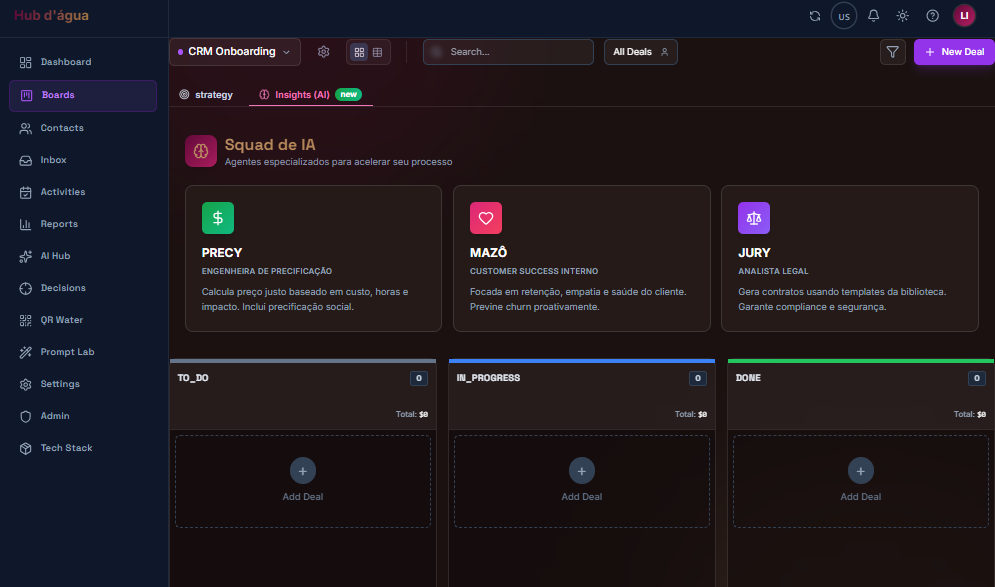
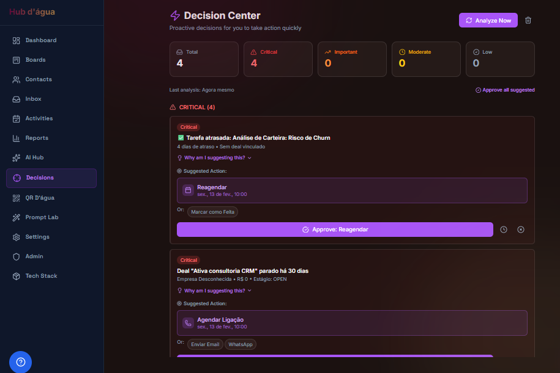
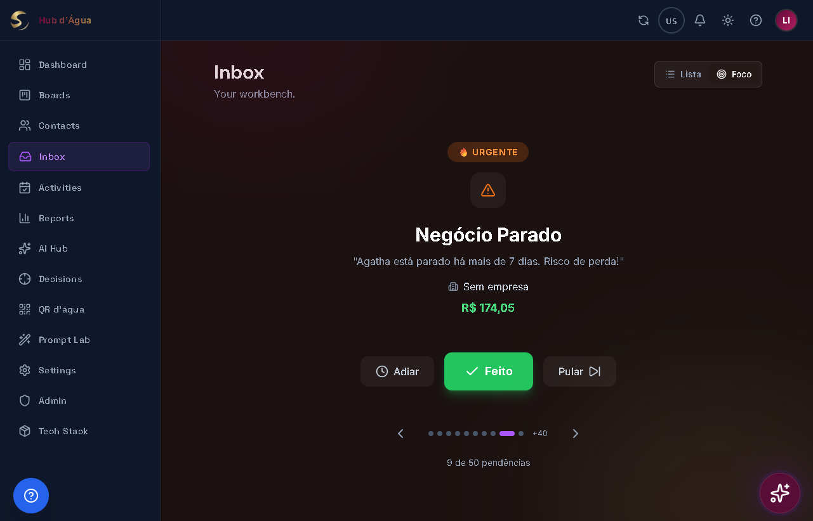

<div align="center">
  
  <h1>Encontro D'Água Hub & CRM</h1>
  <p>Ecossistema de Gestão com IA · Multi-Tenant · Bilingue · LGPD-Ready</p>
</div>

### CRM de Produção `V10.2` — Kommo Partner · Messenger Hub · Data Science (2026-05-14)

> **Branch `main` → hub.encontrodagua.com** — Acesso restrito à equipe interna
> **Branch `provadagua` → prova.encontrodagua.com** — Trial pública 7 dias via Keyword Gate
>
> **V10.1:** Fix definitivo de OOM em inserts inline (company_id JWT), catálogo de produtos conectado ao Board para todos os roles, separador visual Moeda/Idioma, nome "QR d'água" estático, e Migration 057 da Fase 9 (crm_briefings + v_deal_kpis + anti-recursão).

## Demo

> **Vídeo:** [demo-provadagua.mp4](/showcase/demo-provadagua.mp4)
> *Demonstração do login e onboarding de boards com Inteligência Artificial*

| Squad de IA no Kanban | Decision Center | Inbox — Modo Foco |
|---|---|---|
|  |  |  |

---

## Arquitetura Multi-Tenant (Hub vs Provadágua)

O projeto opera em **dois contextos distintos**:

| Contexto | URL | Branch | Acesso | Perfil |
|---|---|---|---|---|
| **Hub Digital** | `hub.encontrodagua.com` | `main` | Super Admin apenas | `is_super_admin = true` |
| **Provadágua** | `prova.encontrodagua.com` | `provadagua` | Keyword Gate → trial 7d | `access_level = provadagua-trial` |

### Fluxo Provadágua (V8.0 — sem Edge Function)
```
/#/showcase  →  [CTA "Experimentar"]  →  /#/login?from=showcase
              →  Aba "Novo Cadastro" (padrão)
              →  Preenche Palavra-chave + Nome + E-mail + Senha
              →  supabase.auth.signUp() nativo (sem CORS, sem Edge Function)
              →  auto-login  →  /dashboard  (trial ativo 7 dias)
              →  Lead inserido em contacts (CRM) automaticamente
```

### Fluxo Hub
```
/#/login  →  Aba "Entrar" (única)  →  SignIn com e-mail/senha
          →  Valida is_super_admin  →  /dashboard
          →  Não-admin: bloqueado + link para /#/showcase
```

---

## Endpoints Principais

| Rota | Acesso | Descrição |
|---|---|---|
| `/#/` | Público | LandingPage Hub |
| `/#/showcase` | Público | ShowcasePage Provadágua (LP pitch) |
| `/#/login` | Público | Login Hub (só SignIn) |
| `/#/login?from=showcase` | Público | Login Provadágua (SignUp + Keyword + SignIn) |
| `/#/dashboard` | Auth | Dashboard CRM (ProtectedRoute) |
| `/#/boards` | Auth | Kanban multi-board com Squad de IA |
| `/#/contacts` | Auth | Contatos isolados por `company_id` |
| `/#/qrdagua` | Auth | QR d'água — Projetos de Links e QR Codes |
| `/#/trial-expired` | Auth | Pós-trial com NPS + CTA fechar negócio |
| `/#/admin` | Admin | Painel CRUD de usuários (Super Admin) |
| `/#/admin/leads` | Admin | Painel de leads Provadágua com trial control |
| `/#/settings` | Auth | Configurações — usuários filtrados por `company_id` |

### Edge Functions (Supabase)

| Função | Método | Descrição |
|---|---|---|
| ~~`signup-showcase`~~ | ~~POST~~ | **DESCONTINUADA V6.6** — substituída por `supabase.auth.signUp()` nativo |
| `form-lp-lead` | POST | Captura lead via LeadCaptureModal → Board |
| `qr-redirect` | GET | Redireciona slug QR Code para URL real |

---

## Gestão de Leads e Multi-tenancy (V8.0)

### Separação de Visões: Super Admin vs Owner/Lead

| Papel | Visão | Rota |
|---|---|---|
| **Super Admin** | Todos os usuários do sistema | `/#/admin` |
| **Owner/Lead (Tenant)** | Apenas usuários da própria `company_id` | `/#/settings` |

### Sistema de Trial (7 dias)

```
Lead se cadastra via Keyword Gate
  → supabase.auth.signUp() + metadata { user_type: 'lead_provadagua' }
  → trial_expires_at = now() + 7 dias (setado no profile)
  → access_level = 'trial'
  → Lead inserido em contacts com source='showcase'
```

**Renovação Manual (Super Admin):**
1. Acessar `/#/admin` → aba Usuários
2. Localizar o lead pela coluna E-mail
3. Clicar em **+7d** para estender o trial
4. Ou clicar em **Suspender** para bloquear acesso imediatamente
5. O modal **Editar** permite ajuste fino: `trial_expires_at`, `access_level`, plano e role

---

## Funcionalidades

| Módulo | Descrição | Status |
|---|---|---|
| **Board Kanban** | Multi-board; leads mapeados ao funil via tag `🤖 sdr` | ✅ Produção |
| **Contatos** | Base isolada por `company_id` (RLS JWT estrito) | ✅ Produção |
| **Catálogo de Produtos** | Conectado ao Board — filtra por `company_id` via JWT | ✅ V10.1 |
| **Deals** | Create/Update/Move com RLS multi-tenant | ✅ Produção |
| **Jury** | Contratos BR + Common Law, PDF inline | ✅ Produção |
| **Precy** | Precificação BRL/USD/AUD com catálogo | ✅ Produção |
| **QR d'água** | QR Codes + Bridge Pages + galeria pública | ✅ Produção |
| **Reports** | Pipeline + Win/Loss real (sem dados demo) | ✅ Produção |
| **Admin** | Usuários, `access_expires_at`, Tech Stack, Super Admin | ✅ Produção |
| **Amazô** | Agente IA: CS/SDR nas LPs + CRM nativo | ✅ Produção |
| **Prompt Lab** | Engenharia de prompts multi-persona | ✅ Produção |
| **Circuit Breaker IA** | Cooldown 10s em erro 429; sem spam de API | ✅ V9.9.7 |
| **Global Currency** | BRL/USD/AUD com seletor no header | ✅ V9.9.7 |
| **ShowcasePage** | LP pública `/showcase` bilingue com FAQ + QA + Tech | ✅ Produção |
| **Trial Gate** | Keyword `provadagua` → signup imediato · 7d trial | ✅ Produção |
| **TrialExpiredPage** | NPS + feedback + CTA fechar negócio | ✅ Produção |
| **crm_briefings** | Tabela Fase 9 — briefings versionados do Link D'água | 🔧 Migration 057 |
| **v_deal_kpis** | View KPI: deals + QR scans + briefing ativo | 🔧 Migration 057 |

---

## Padrão de Segurança RLS (Obrigatório desde Migration 056)

**Regra de ouro:** Nenhuma política RLS pode fazer `SELECT` em `profiles`. O `company_id` e `is_super_admin` são lidos **exclusivamente** via claims do JWT:

```sql
-- CORRETO (Migration 056+):
company_id = (auth.jwt() ->> 'company_id')::uuid
(auth.jwt() ->> 'is_super_admin') = 'true'

-- PROIBIDO (causa recursão/OOM):
(SELECT company_id FROM profiles WHERE id = auth.uid())
```

### Migrations Críticas

| Migration | Descrição |
|---|---|
| `054` | Fix recursão infinita em RLS de `profiles` |
| `055` | JWT company_id em inserts de contacts/deals |
| `056` | RLS puro JWT em contacts, deals, crm_companies — zero subqueries em profiles |
| `057` | Fase 9: `crm_briefings` + `v_deal_kpis` + `upsert_briefing()` |

---

## Stack

- **Frontend**: React 18 + TypeScript + Vite + TailwindCSS
- **Backend**: Supabase (PostgreSQL + Auth + RLS + Edge Functions)
- **IA**: Google Gemini (principal), OpenAI, Anthropic (fallback) + Circuit Breaker
- **CRM**: Kommo (Parceiro Certificado — integração Messenger-first)
- **Deploy**: Vercel (branch-based: `main` → hub / `provadagua` → prova)
- **Contato Principal**: Facebook Messenger (`m.me/encontrodagua`)
- **Pagamentos**: Stripe (Prompt Lab Mensal R$3 · Anual R$29,90 · Agente IA R$80)

---

## Variáveis de Ambiente

```env
# ── Públicas (bundled no client JS) ──────────────────────────────────
VITE_APP_MODE=PRODUCTION          # DEMO em prova.encontrodagua.com
VITE_SUPABASE_URL=https://...     # Supabase Project URL
VITE_SUPABASE_ANON_KEY=eyJ...     # Anon key (segura — scoped por RLS)
VITE_GEMINI_API_KEY=AIza...       # Google Gemini principal
VITE_GEMINI_API_KEY_SECONDARY=... # Google Gemini fallback (Circuit Breaker)
VITE_GA4_MEASUREMENT_ID=G-...     # Google Analytics 4
VITE_ACCESS_KEYWORD=provadagua    # Keyword Gate — mude para aumentar segurança
VITE_VAPID_PUBLIC_KEY=BE-...      # Web Push (público)

# ── Privadas (APENAS Vercel Secrets / .env local) ─────────────────────
SUPABASE_SERVICE_ROLE_KEY=...     # NUNCA expor — server-only / Edge Functions
```

> ⚠️ `SUPABASE_SERVICE_ROLE_KEY` **jamais deve ter prefixo `VITE_`** — se tiver, rotate imediatamente.

---

## Deploy

```bash
# Provadágua (branch provadagua)
git push origin provadagua
# Vercel detecta → build → prova.encontrodagua.com

# Hub (branch main)
git push origin main
# Vercel detecta → build → hub.encontrodagua.com
```

---

## Estrutura

```
src/
  pages/
    LandingPage.tsx      # Hub LP — inclui CTA Provadágua após CRMSimulator
    ShowcasePage.tsx     # Provadágua pitch LP bilingue completa
    Login.tsx            # Multi-rota: Hub SignIn / Showcase SignUp+Keyword
    TrialExpiredPage.tsx # Pós-trial: NPS + fechar negócio
  features/              # Módulos CRM (boards, contacts, admin, qrdagua, ...)
  lib/
    supabase/            # Services com IS_DEMO guards + companyId filtros
    analytics.ts         # GA4 eventos (trial_start, lead_capture, login, sign_up)
  hooks/
    useTranslation.ts    # i18n PT-BR / EN / ES
  components/
    Layout.tsx           # Header com Currency + Language separados por divisor
    CurrencySwitcher.tsx # BRL/USD/AUD — reativo via contexto global
  services/
    geminiService.ts     # Circuit Breaker: cooldown 10s em 429, 1 tentativa fallback
```

---

## Roadmap / Próximos Passos (Pós-Validação V10.x)

| Feature | Status | Prioridade |
|---|---|---|
| **Fase 9: Aplicar Migration 057** | ⚠️ Ação obrigatória | **Crítica** |
| **Fase 9: Frontend crm_briefings** — card KPI no Kanban | 🔧 Em desenvolvimento | Alta |
| **Link D'água → CRM Sync** — `upsert_briefing()` na jornada do usuário | 🔧 Planejado | Alta |
| **Gestão Autônoma de Equipes** — convite por link com company_id | 📋 Em breve | Alta |
| Confirmação de e-mail de convite via Supabase | 📋 Backlog | Alta |
| Notificação automática no WA ao expirar o trial | 🕐 Planejado | Média |
| Materialized View `v_deal_kpis` + pg_cron (se >10k deals) | 🕐 Upgrade path | Média |
| Export de contatos / deals em CSV | 🕐 Planejado | Baixa |

---

*Mantido pela equipe Encontro d'Água | Manager: Antigravity AI | V10.2 — Kommo Partner · Messenger Hub*
