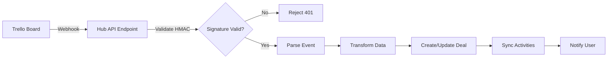

# System Architecture - Encontro D'Água Hub

## Overview

O Encontro D'Água Hub é um **Business Operating System** completo, evoluindo de um CRM tradicional para um centro de comando de agência com IA integrada.

---

## 🤖 AI Agents Architecture

### 1. Amazo - Hub Manager (SuperAdmin Agent)

**Nova Definição** (15/12/2025):

#### Papel
- **Gerente do Hub**: Orquestra todos os outros agentes e processos
- **Assistente de Desenvolvimento**: Gerencia o desenvolvimento enquanto a usuária foca na criação
- **Filosofia**: Aprendizado Heutagógico - o agente aprende e se adapta ao estilo de trabalho da usuária

#### Permissões
- **Nível de Acesso**: SuperAdmin
- **Escopo**: Leitura/escrita transversal em todo o CRM
- **Capacidades**:
  - Acesso a todas as tabelas do Supabase
  - Criação e modificação de boards, deals, contatos
  - Execução de agentes especializados
  - Gerenciamento de templates e bibliotecas
  - Análise de métricas e relatórios

#### Responsabilidades
1. **Orquestração de Agentes**:
   - Invocar agente de Precificação quando necessário
   - Consultar agente Jurídico para contratos
   - Acionar Documentador para gerar documentos finais

2. **Gestão de Conhecimento**:
   - Manter Stack Knowledge Base atualizado
   - Sugerir ferramentas do stack para novos projetos
   - Documentar decisões e aprendizados

3. **Automação de Processos**:
   - Criar atividades e lembretes automaticamente
   - Mover deals entre estágios baseado em triggers
   - Gerar relatórios periódicos

#### Implementação Técnica
- **Arquivo**: `src/features/ai-hub/hooks/useCRMAgent.ts`
- **Model**: Gemini 2.5 Flash Lite (fallback: 1.5 Flash)
- **Tools**: 12+ ferramentas conectadas (searchDeals, createActivity, etc.)
- **Context**: Acesso completo ao perfil do usuário e dados do CRM

---

### 2. Agente de Precificação

**Status**: ⏳ Planejado (Placeholder criado)

#### Função
- Calcular orçamentos baseado em escopo de projeto
- Considerar complexidade, prazo, stack tecnológico
- Sugerir preços competitivos baseado em histórico

#### Implementação Futura
- Webhook N8N: `calculatePricing()`
- Input: Descrição do projeto, prazo, requisitos
- Output: Orçamento detalhado com breakdown de custos

---

### 3. Agente Jurídico

**Status**: ⏳ Planejado (Placeholder criado)

#### Função
- Análise de contratos e termos legais
- Identificação de cláusulas problemáticas
- Sugestão de melhorias em documentos

#### Implementação Futura
- Webhook N8N: `consultLegalAgent()`
- Input: Texto do contrato
- Output: Análise de riscos e sugestões

---

### 4. Documentador (NOVO)

**Status**: ⏳ Planejado (Backlog)

#### Função
- Pegar template da Biblioteca Compartilhada
- Preencher com dados do CRM (cliente, deal, empresa)
- Gerar documento final pronto para uso

#### Casos de Uso
- **Contratos**: Template de contrato + dados do cliente → Contrato preenchido
- **Propostas**: Template de proposta + dados do deal → Proposta comercial
- **Planos de Negócio**: Template + dados da empresa → Business plan completo

#### Implementação Futura
- Nova tabela: `document_templates`
- Nova tool: `generateDocument({ templateId, dealId, data })`
- Output: PDF ou DOCX pronto para download

---

## 📚 Shared Library (Biblioteca Compartilhada)

**Status**: ⏳ Planejado (Backlog - Prioridade Alta)

### Objetivo
Permitir que usuários salvem e compartilhem templates reutilizáveis dentro do Hub.

### Funcionalidades

#### 1. Templates Privados
- Usuário cria template e marca como "Privado"
- Apenas o criador e sua company têm acesso
- Exemplos: Contrato padrão da agência, proposta personalizada

#### 2. Templates Públicos (Hub)
- Templates criados pela equipe do Hub
- Disponíveis para todos os usuários
- Exemplos: Contrato de desenvolvimento web, NDA padrão, proposta de design

#### 3. Clonagem de Templates
- Usuário pode clonar template público para sua biblioteca privada
- Permite customização sem afetar o original
- Versionamento automático

### Tipos de Templates

#### A) Contratos
- Campos: Título, Corpo do texto, Variáveis ({{cliente_nome}}, {{valor}}, etc.)
- Categorias: Desenvolvimento, Design, Consultoria, NDA
- Formato de saída: PDF, DOCX

#### B) Prompts
- Campos: Título, System Prompt, User Prompt, Persona
- Categorias: Copywriting, Código, Design, Marketing
- Integração com Prompt Lab

#### C) Planos de Negócio
- Campos: Estrutura (Sumário Executivo, Análise de Mercado, etc.)
- Variáveis: Dados da empresa, projeções financeiras
- Formato de saída: PDF, PPTX

### Schema do Banco de Dados

```sql
CREATE TABLE document_templates (
  id UUID PRIMARY KEY DEFAULT uuid_generate_v4(),
  title TEXT NOT NULL,
  description TEXT,
  type TEXT NOT NULL, -- 'contract', 'prompt', 'business_plan'
  category TEXT,
  content JSONB NOT NULL, -- Template body com variáveis
  variables JSONB, -- Lista de variáveis disponíveis
  is_public BOOLEAN DEFAULT false,
  owner_id UUID REFERENCES profiles(id),
  company_id UUID REFERENCES companies(id),
  cloned_from UUID REFERENCES document_templates(id),
  usage_count INTEGER DEFAULT 0,
  created_at TIMESTAMPTZ DEFAULT NOW(),
  updated_at TIMESTAMPTZ DEFAULT NOW()
);

-- RLS Policies
-- Users veem templates públicos + seus próprios templates privados
-- Admins podem criar templates públicos
```

### Interface (Planejado)

#### Rota: `/library`
- Grid de cards com templates
- Filtros: Tipo, Categoria, Público/Privado
- Botões: "Usar Template", "Clonar", "Editar" (se owner)
- Modal de criação/edição de template

#### Integração com Documentador
1. Usuário seleciona template na biblioteca
2. Clica em "Gerar Documento"
3. Modal pede dados adicionais (se necessário)
4. Documentador preenche variáveis com dados do CRM
5. Documento final é gerado e salvo no deal

---

## 🏗️ Tech Stack

### Frontend
- React 19 + TypeScript
- Vite (build tool)
- Tailwind CSS (styling)
- Lucide React (icons)

### Backend
- Supabase (Database + Auth + Storage)
- PostgreSQL (database)
- Row Level Security (RLS)

### AI/ML
- Google Gemini 2.5 Flash Lite (primary)
- Google Gemini 1.5 Flash (fallback)
- Function calling / Tool use

### DevOps
- Vercel (hosting)
- GitHub (version control)
- N8N (workflow automation - planejado)

---

## 📊 Database Schema (Principais Tabelas)

### Core Tables
- `profiles` - Usuários do sistema
- `companies` - Multi-tenancy
- `boards` - Kanban boards
- `deals` - Negócios/oportunidades
- `contacts` - Pessoas e empresas
- `activities` - Tarefas e eventos

### Feature Tables
- `qr_codes` - QR d'água projects
- `document_templates` - Biblioteca compartilhada (planejado)
- `agents` - Agentes especializados (planejado)
- `tech_stack` - Stack knowledge base (planejado)

---

## 🔐 Security & Permissions

### Role-Based Access Control (RBAC)
- **Super Admin**: Acesso total (Amazo agent)
- **Admin**: Acesso completo à sua company
- **User**: Acesso limitado (CRUD próprios dados)

### Row Level Security (RLS)
- Tenant isolation por `company_id`
- Policies específicas por tabela
- SECURITY DEFINER functions para bypass controlado

---

## 🔗 Webhook Integration Architecture

### Overview
O Hub funciona como **centro de comando centralizado** para gerenciar múltiplos sistemas externos:
- **CRMs de Clientes** (NovaMind, RD Station, etc.)
- **Ferramentas de Produtividade** (Trello, Asana, etc.)
- **Sistemas de Pagamento** (Stripe, Pagar.me, etc.)

Todos os sistemas externos enviam eventos via webhooks seguros (HMAC-256) para o Hub, que processa e transforma os dados em ações no Kanban centralizado.

---

### 1. Client CRM Integration (NovaMind, RD Station)

#### Event Types
- `deal.created` - Novo negócio criado no CRM do cliente
- `deal.moved` - Negócio mudou de estágio
- `deal.closed_won` - Negócio ganho
- `deal.closed_lost` - Negócio perdido
- `deal.stagnant` - Negócio sem atividade por X dias
- `contact.churned` - Cliente cancelou/desistiu

#### Communication Flow
```
Client CRM → Webhook → Hub API Endpoint (Supabase Edge Function) 
→ Event Processor → Supabase Database → Hub Dashboard → Admin Monitoring
```

#### Security
- **HMAC-256 Signature**: Cada webhook inclui header `X-Hub-Signature-256`
- **TLS Encryption**: Comunicação sempre via HTTPS
- **Privacy First**: Payloads contêm apenas IDs e metadados, sem PII
- **API Key Rotation**: Chaves podem ser renovadas via painel admin

#### Database Schema
```sql
CREATE TABLE webhook_events (
  id UUID PRIMARY KEY DEFAULT uuid_generate_v4(),
  source TEXT NOT NULL, -- 'novamind', 'trello', 'stripe'
  event_type TEXT NOT NULL,
  payload JSONB NOT NULL,
  signature TEXT NOT NULL,
  processed BOOLEAN DEFAULT false,
  created_at TIMESTAMPTZ DEFAULT NOW()
);

CREATE TABLE client_api_keys (
  id UUID PRIMARY KEY DEFAULT uuid_generate_v4(),
  client_company_id UUID REFERENCES companies(id),
  api_key TEXT UNIQUE NOT NULL,
  hmac_secret TEXT NOT NULL,
  is_active BOOLEAN DEFAULT true,
  created_at TIMESTAMPTZ DEFAULT NOW()
);
```

---

### 2. Trello Integration (Personal Productivity)

#### Objective
Gerenciar tarefas pessoais e freelas do Trello diretamente no Hub, transformando cards Trello em tasks no Kanban centralizado.

#### Event Types (Trello Webhooks)
- `createCard` - Novo card criado
- `updateCard` - Card atualizado (nome, descrição, labels)
- `updateCard:idList` - Card movido entre listas
- `updateCard:closed` - Card arquivado/reaberto
- `addChecklistToCard` - Checklist adicionada
- `updateCheckItemStateOnCard` - Item de checklist marcado/desmarcado
- `addMemberToCard` - Membro atribuído ao card
- `commentCard` - Comentário adicionado

#### Transformation Logic: Trello → Hub

| Trello Element | Hub Equivalent | Mapping Logic |
|----------------|----------------|---------------|
| **Board** | `Board` (Kanban) | 1:1 - Cada board Trello = 1 board no Hub |
| **List** | `Stage` (Coluna) | Nome da lista → Nome da coluna |
| **Card** | `Deal` (Task) | Card title → Deal title |
| **Description** | `notes` field | Markdown preservado |
| **Labels** | `tags` array | Cores e nomes mapeados |
| **Checklist** | `activities` | Cada item = 1 activity |
| **Due Date** | `deadline` | ISO 8601 timestamp |
| **Members** | `assigned_to` | Trello user ID → Hub profile ID |
| **Comments** | `activities` (type: comment) | Autor + timestamp preservados |

#### Implementation Flow



#### Trello Webhook Setup

**1. Register Webhook (One-time)**
```bash
POST https://api.trello.com/1/webhooks/
{
  "description": "Hub Sync",
  "callbackURL": "https://hub.encontrodagua.com.br/api/webhooks/trello",
  "idModel": "{BOARD_ID}",
  "key": "{TRELLO_API_KEY}",
  "token": "{TRELLO_TOKEN}"
}
```

**2. Hub Endpoint (Supabase Edge Function)**
```typescript
// supabase/functions/trello-webhook/index.ts
import { serve } from 'https://deno.land/std@0.168.0/http/server.ts'
import { createClient } from 'https://esm.sh/@supabase/supabase-js@2'

serve(async (req) => {
  // 1. Validate Trello signature
  const signature = req.headers.get('X-Trello-Webhook')
  if (!validateTrelloSignature(signature, await req.text())) {
    return new Response('Unauthorized', { status: 401 })
  }

  // 2. Parse event
  const event = await req.json()
  
  // 3. Transform Trello card → Hub deal
  const deal = transformTrelloCard(event.action.data.card)
  
  // 4. Upsert to Supabase
  const supabase = createClient(...)
  await supabase.from('deals').upsert(deal)
  
  return new Response('OK', { status: 200 })
})
```

#### Security Considerations
- **Trello Signature Validation**: Verify `X-Trello-Webhook` header
- **Board Whitelisting**: Only sync boards explicitly configured
- **Rate Limiting**: Max 100 events/minute per board
- **Data Privacy**: Trello cards podem conter dados sensíveis - aplicar RLS rigoroso

#### Database Extensions
```sql
-- Add Trello sync metadata to deals table
ALTER TABLE deals ADD COLUMN trello_card_id TEXT UNIQUE;
ALTER TABLE deals ADD COLUMN trello_board_id TEXT;
ALTER TABLE deals ADD COLUMN last_synced_at TIMESTAMPTZ;

-- Trello sync configuration
CREATE TABLE trello_sync_config (
  id UUID PRIMARY KEY DEFAULT uuid_generate_v4(),
  user_id UUID REFERENCES profiles(id),
  trello_board_id TEXT NOT NULL,
  hub_board_id UUID REFERENCES boards(id),
  webhook_id TEXT, -- Trello webhook ID
  is_active BOOLEAN DEFAULT true,
  sync_direction TEXT DEFAULT 'bidirectional', -- 'trello_to_hub', 'hub_to_trello', 'bidirectional'
  created_at TIMESTAMPTZ DEFAULT NOW()
);
```

---

### 3. Unified Webhook Architecture

#### Common Patterns
Todos os webhooks (CRM, Trello, Stripe) seguem o mesmo padrão:

1. **Endpoint**: Supabase Edge Function (`/api/webhooks/{source}`)
2. **Authentication**: HMAC-256 signature validation
3. **Processing**: Event → Transformation → Database Update
4. **Notification**: Real-time updates via Supabase Realtime
5. **Logging**: Todos os eventos salvos em `webhook_events` para auditoria

#### Benefits
- **Single Source of Truth**: Hub é o centro de comando
- **Real-time Sync**: Mudanças refletidas instantaneamente
- **Audit Trail**: Histórico completo de eventos
- **Privacy First**: Dados sensíveis nunca trafegam nos webhooks
- **Scalable**: Supabase Edge Functions escalam automaticamente

---

### Implementation Phases

#### Phase 1: Foundation (Current)
- ✅ Webhook architecture documented
- ✅ HMAC security pattern defined
- ⏳ Supabase Edge Functions setup

#### Phase 2: Client CRM Integration
- [ ] Create `webhook_events` table
- [ ] Implement HMAC validation
- [ ] Build event processor
- [ ] Create admin dashboard for monitoring

#### Phase 3: Trello Integration
- [ ] Register Trello webhooks
- [ ] Implement transformation logic
- [ ] Create sync configuration UI
- [ ] Test bidirectional sync

#### Phase 4: Advanced Features
- [ ] Conflict resolution (bidirectional sync)
- [ ] Bulk import from Trello
- [ ] Webhook retry mechanism
- [ ] Analytics dashboard

---

## 🚀 Roadmap

### Fase Atual (v1.4)
- ✅ Layout.tsx duplication fix
- ✅ FloatingAIWidget Açaí theme
- ✅ Sistema estável para cliente real
- ✅ Language toggle (🇧🇷/🇺🇸) implementation
- ✅ Full i18n support (sidebar, menus, UsersPage)

### Próxima Fase (v1.5)
- ⏳ Shared Library (Templates)
- ⏳ Documentador Agent
- ⏳ Amazo SuperAdmin implementation
- ⏳ Webhook Integration (Phase 1)
- ⏳ Demo Mode (privacy-first demonstrations)

### Backlog Estratégico
- Stack Knowledge Base
- Agent Hub (Prompt Lab evolution)
- GitHub Lifecycle Sync
- Landing Page pública
- Analytics dashboard

---

## 📝 Notas de Arquitetura

### Princípios de Design
1. **Context-Aware AI**: Agentes sempre têm contexto completo
2. **No-Code First**: Usuário não-técnico deve conseguir operar
3. **Automation by Default**: Se pode ser automatizado, deve ser
4. **Single Source of Truth**: Hub é a fonte única de verdade

### Filosofia do Sistema
- De CRM → Business Operating System
- De "Gestão de Vendas" → "Centro de Comando da Agência"
- De "Dados Isolados" → "Inteligência Conectada"

---

**Última Atualização**: 15/12/2025  
**Versão**: 1.4  
**Autor**: Equipe Encontro D'Água
